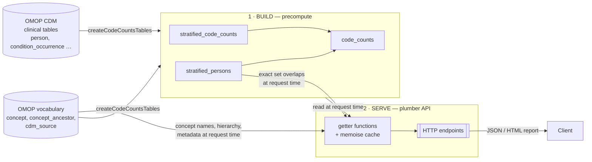

# ROMOPAPI — Project Structure

ROMOPAPI is an R package that serves aggregate statistics (code counts and
concept reports) computed from an **OMOP CDM** database
It works in two phases:

1. **Build** — a one-off job scans the OMOP CDM and writes small *precomputed
   counts tables* into the results schema. Repeated whenever the data or the
   counting logic changes.
2. **Serve** — a [plumber](https://www.rplumber.io/) API answers requests by
   reading those precomputed tables, wrapping the results in reports and JSON.

Everything runs against any OMOP CDM: local **SQLite** (Eunomia,
for tests/demo) or remote **BigQuery** (FinnGen, for production). SQL is written
once in the OHDSI SQL Server dialect and translated per backend with `SqlRender`.

Note that the API reads from **two** sources at request time: the precomputed
counts tables *and* the OMOP vocabulary tables (`concept`, `concept_ancestor`,
`cdm_source`) — the counts hold the numbers, the vocabulary supplies concept
names, hierarchy and metadata.

The rest of this document walks through each part, starting from the shared
database layer that everything else is built on.

---

## 0 · File structure

The repo is a **standard R package** — most of the layout is the conventional
one and behaves as you'd expect:

- `R/` — package source (all functions). `DESCRIPTION`, `NAMESPACE`, `NEWS.md`,
  `LICENSE` — package metadata. `tests/` — testthat suite. `vignettes/` —
  long-form docs. `inst/` — files installed alongside the package (`sql/`,
  `reports/`, `plumber/`, `scripts/`, `testdata/`).
- **Tool-managed, don't hand-edit:** `man/` and `NAMESPACE` are generated by
  roxygen2 (`devtools::document()`); `renv/` + `renv.lock` are the renv
  dependency lockfiles.

A few things depart from the standard layout:

- **Non-standard files kept in the repo:** `Dockerfile` / `.dockerignore`
  (production image), `.github/` (CI), `development/` (this doc + `STYLE.md` —
  contributor guides, excluded from the build via `.Rbuildignore`),
  `CLAUDE.md` / `AGENTS.md` + `.claude/` (agent instructions and skills),
  `R/api.R` (a superseded `create_api()` stub — see §4).
- **Kept local via `.gitignore`** (not committed, and why):
  - `GITHUBPAT.txt` — GitHub PAT for the Docker build secret; a credential, must
    never be committed.
  - `eunomia_data/`, `FinnGenR12_v5.4*.sqlite` — downloaded/large OMOP database
    files; too big for git and reproducible on demand.
  - `errorReportSql.txt` — SqlRender's error dump, regenerated on each failure.
  - `renv/`, `renv.lock`, `.Rprofile` — local renv environment state.
  - `.scratchpad/` — a personal scratch space for tmp ideas, throwaway tests
    and working notes; never part of the package.

---

## 1 · Database access layer

Every function in the package — build and serve alike — takes a single object
that owns the connection and knows where the tables live.

- **`CDMdbHandler`** (`R/HadesExtras.R`) bundles the DBI connection and the three
  schema names it addresses:
  - `cdmDatabaseSchema` — the OMOP CDM **clinical** tables (`person`,
    `condition_occurrence`, `observation_period`, …), read only during the build.
  - `vocabularyDatabaseSchema` — the OMOP **vocabulary** tables (`concept`,
    `concept_ancestor`, `cdm_source`), read during both build and serve.
  - `resultsDatabaseSchema` — where the precomputed counts tables are written and
    later read from.
  It is **vendored** from HadesExtras v1.1.2 to avoid a heavy dependency — don't
  edit it to add features; re-sync from upstream if needed.
- **`HadesExtras_createCDMdbHandlerFromList()` / `HadesExtras_readAndParseYaml()`**
  build the handler from a parsed `databasesConfig.yml`.
- **`DatabaseConnector`** comes from a fork
  (`javier-gracia-tabuenca-tuni/DatabaseConnector@bigquery-DBI-2`) that adds
  BigQuery DBI support — intentional, see AGENTS.md → *Dependencies*.
- **`SqlRender`** renders `@param` placeholders and translates SQL Server → target
  dialect at runtime. The dialect folder (`inst/sql/sql_server` vs
  `inst/sql/bigquery`) is chosen from `connection@dbms`.

---

## 2 · Precompute: the counts tables

The build phase produces **three** tables in the results schema, in order. The
first two are fine-grained (one stratified by event, one by person); the third
rolls both up along the concept hierarchy. Entry point: `createCodeCountsTables()`
(`R/createCodeCountsTables.R`), called by `runApiServer(buildCountsTable = TRUE)`.

### 2a · `stratified_code_counts`

One row per unique combination of stratification keys, for every domain:

| Column | Meaning |
|--------|---------|
| `concept_id` | standard OMOP concept of the event |
| `maps_to_concept_id` | the source concept it maps from |
| `visit_group_concept_id` | FinnGen visit-source grouping (`0` when disabled) |
| `calendar_year`, `gender_concept_id`, `age_decile` | demographic / time strata |
| `record_counts` | number of events in that stratum |

- **R:** `createStratifiedCodeCountsTable()`
  (`R/createStratifiedCodeCountsTable.R`) creates the empty table, then loops
  over the OMOP domains (Condition, Procedure, Drug, Measurement, Observation,
  Device, Visit) and appends one domain at a time. The domain→table/field map is
  defined inline in that function.
- **SQL:** `inst/sql/{sql_server,bigquery}/appendToStratrifiedCodeCountsTable.sql`
  joins each domain table to `person` and `observation_period`, derives the
  strata, and `GROUP BY`s to counts. Events are kept even when the standard
  concept is unmapped (`concept_id = 0`) as long as the source concept is known.
- **Visit grouping** is guarded by SqlRender's
  `{@visit_group_concept_ids != 0} ? {…} : {0}` so the same template works with
  or without the FinnGen visit-source-group list (see AGENTS.md →
  *Database-dependent settings*).

### 2b · `stratified_persons` — the exact person-level bridge

Distinct-person counts can't be summed across strata, and overlap questions
(does this person also have that other code?) need the actual person, not a
summary. So a second table keeps `person_id` instead of collapsing it to a
count — one row per distinct `concept_id × stratum × person_id`:

| Column | Meaning |
|--------|---------|
| `person_id` | the OMOP person |
| `concept_id`, `maps_to_concept_id`, `visit_group_concept_id`, `calendar_year`, `gender_concept_id`, `age_decile` | same grain as `stratified_code_counts` |

`createStratifiedPersonsTable()` (`R/createStratifiedPersonsTable.R`) mirrors
`createStratifiedCodeCountsTable()` — same domain loop, same per-domain SQL
templates (`inst/sql/{sql_server,bigquery}/appendToStratifiedPersonsTable.sql`),
just `SELECT DISTINCT` instead of `COUNT`/`GROUP BY`. `COUNT(DISTINCT person_id)`
over this table is exact on every backend (unlike a sketch, it works the same
on SQLite and BigQuery) and is what `code_counts` (§2c), `getPersonCountsFilters()`
and `getPersonCountsUpset()` (§3) build on. See `.scratchpad/no_HLL_or_sketches.md` for why sketches
(HLL/KMV/Theta) were rejected in favor of this exact bridge: strata are small
(median ~5 persons/row) so exact overlap is cheap, and sketches either can't
intersect at all (HLL) or need to sample nearly the whole set to resolve the
tiny bars an overlap plot cares about.

### 2c · `code_counts` — how the stratified tables are rolled up

`code_counts` is derived **from** `stratified_code_counts` and
`stratified_persons` (it never touches the raw CDM again), inside
`inst/sql/{sql_server,bigquery}/createCodeCountsTable.sql`:

1. **Collapse strata → atomic per-concept counts.** Sum `record_counts` (and,
   from the person bridge, take distinct persons) across all strata for each
   concept. Two sources are unioned so both the standard concept and its
   unmapped source code get a row: grouping by `concept_id`, then by
   `maps_to_concept_id` where the two differ.
2. **Add the hierarchy → descendant rollup.** Join those atomic counts to
   `concept_ancestor` so every concept also gets the sum of **all its
   descendants'** event counts, a count of how many descendants it has, and the
   **distinct** person count across the concept and its descendants (computed
   as `COUNT(DISTINCT person_id)` over the bridge — descendant person counts are
   never summed, since the same person can appear under more than one
   descendant).

The result is one row per concept:

| Column | Meaning |
|--------|---------|
| `concept_id` | the concept |
| `record_counts` | its own events (atomic, from step 1) |
| `descendant_record_counts` | events of the concept **and all descendants** (step 2) |
| `number_of_descendants` | size of that descendant set |
| `person_counts` | distinct persons with the concept's own events |
| `descendant_person_counts` | distinct persons across the concept **and all descendants** |

This table powers the "does this concept have any data, and how much" lookups
that the API front-loads (`getAllConceptsInfo`'s underlying join, and
`getConceptRelationships()$concepts`), while `stratified_code_counts` is kept
for the per-concept, per-stratum detail `/getCodeCountsStratified` and
`/report` need, and `stratified_persons` backs the exact stratum breakdowns and
set-overlap regions `/getPersonCountsFilters` and `/getPersonCountsUpset` need.

---

## 3 · Data-extraction functions (getters)

Plain R functions that read the precomputed tables (from `resultsDatabaseSchema`)
and join in the vocabulary tables (from `vocabularyDatabaseSchema`) for names,
hierarchy and metadata. Each has a **`_memoise`** twin (via the `memoise`
package) that caches results in-process; the `CDMdbHandler` argument is omitted
from the cache key. The API calls the memoised versions.

| Function (file) | Reads from | Returns |
|-----------------|------------|---------|
| `getAllConceptsInfo()` (`R/getAllConceptsInfo.R`) | `code_counts` ⨝ `concept` (join only restricts to concepts that have counts — the counts themselves aren't returned) — the catalogue of every concept that has counts, with its name/vocabulary/class | tibble |
| `getConceptTree()` (`R/getConceptTree.R`) | `concept_ancestor` — builds the family tree pruned to nodes that have counts or a counted descendant. Shared by `getConceptRelationships()`, `getCodeCountsStratified()`, `getPersonCountsFilters()` and `getPersonCountsUpset()` so the tree is built once | list(family_tree, concept_ids) |
| `getConceptRelationships()` (`R/getConceptRelationships.R`) | `getConceptTree_memoise` (the tree) and `code_counts` ⨝ `concept` scoped to the tree's concept ids (for details + counts); 'Maps to'/'Mapped from' are derived from the stratified table's `maps_to_concept_id` column | list of tibbles |
| `getCodeCountsStratified()` (`R/getCodeCountsStratified.R`) | `getConceptTree_memoise` (the tree) and `stratified_code_counts` (per-stratum counts for the concept, its descendants and mapped codes) | tibble |
| `getPersonCountsFilters()` (`R/getPersonCountsFilters.R`) | `getConceptTree_memoise` (the tree) and `stratified_persons` (the exact person bridge) — sex/age/visit breakdowns for the tree (concept + all descendants), over an optional `yearsRange` | tibble |
| `getPersonCountsUpset()` (`R/getPersonCountsUpset.R`) | `getConceptTree_memoise` (the tree) and `stratified_persons` — exact set-overlap (UpSet) regions for the tree, over an optional `yearsRange`; per-concept `person_counts`/`descendant_person_counts` are read from `code_counts` via `getConceptRelationships()`'s `concepts` tibble instead of being duplicated here | tibble |
| `getVisitTypeNames()` (`R/getVisitTypeNames.R`) | `stratified_code_counts` (distinct `visit_group_concept_id`) ⨝ `concept` (their names/codes) | tibble |
| `getAPIInfo()` (`R/getAPIInfo.R`) | `cdm_source` (CDM name, vocabulary version) + package version | list |
| `getLogs()` / `sendFeedback()` (`R/getLogs.R`, `R/sendFeedback.R`) | in-process log file / feedback capture — no DB | — |

### Output shapes

Exact columns each getter returns. All names are **snake_case** (see STYLE.md →
*SQL*). These are also what the endpoints serialize to JSON — the endpoints are
thin wrappers, except where noted.

#### `getAllConceptsInfo()` → one tibble

One row per concept that has counts. The catalogue the API front-loads.

| Column | Meaning |
|--------|---------|
| `concept_id` | the concept |
| `concept_name` | human-readable name |
| `domain_id` | OMOP domain (Condition, Procedure, Drug, …) |
| `vocabulary_id` | vocabulary (SNOMED, ICD10, …) |
| `concept_class_id` | concept class |
| `standard_concept` | logical — `TRUE` for standard concepts |
| `concept_code` | source code within the vocabulary |

Counts (`record_counts`, `descendant_record_counts`, `number_of_descendants`,
`person_counts`, `descendant_person_counts`) are **not** included — this is a
pure concept-metadata catalogue; read counts from `code_counts` directly (e.g.
via `getConceptRelationships()$concepts` below).

> The `/getListOfConcepts` endpoint returns a **subset** of these columns:
> `concept_id`, `concept_name`, `vocabulary_id`, `concept_code`.

#### `getConceptTree()` → `list(family_tree, concept_ids)`

The tree-building block shared by `getConceptRelationships()`,
`getCodeCountsStratified()`, `getPersonCountsFilters()` and
`getPersonCountsUpset()` (memoised as `getConceptTree_memoise`). `family_tree`
has the same `parent_concept_id`/`child_concept_id`/`levels`/`paths` shape as
the tree rows in `concept_relationships` below (minus the mapping edges, which
`getConceptRelationships()` derives separately since it depends on its own
counts read). `concept_ids` is the unique, `"-1"`-excluded concept-id list used
to query the counts tables.

#### `getConceptRelationships()` → list of **two** tibbles

Keyed `concept_relationships`, `concepts`.

**`concept_relationships`** — the concept's family tree plus mapping edges. One
row per parent→child edge:

| Column | Meaning |
|--------|---------|
| `parent_concept_id` | parent (ancestor) concept |
| `child_concept_id` | child (descendant), or the mapped concept for mapping edges |
| `levels` | edge type / depth: `"0"` (the queried concept), `"-1"` (its direct parent), `"N-M"` (min–max hierarchy levels), or `"Maps to"` / `"Mapped from"` |
| `concept_class_id` | concept class of the child |

**`concepts`** — details for every concept referenced in the tree (same columns
as `getAllConceptsInfo` plus the counts columns, minus `number_of_descendants`):
`concept_id`, `concept_name`, `domain_id`, `vocabulary_id`, `concept_class_id`,
`standard_concept`, `concept_code`, `record_counts`, `descendant_record_counts`,
`person_counts`, `descendant_person_counts`.

#### `getCodeCountsStratified()` → one tibble

Per-concept, per-stratum counts for every node in the tree:

| Column | Meaning |
|--------|---------|
| `concept_id` | the concept |
| `visit_group_concept_id` | FinnGen visit-source grouping (`0` when disabled) |
| `calendar_year`, `gender_concept_id`, `age_decile` | demographic / time strata |
| `node_record_counts` | events of this concept in the stratum |
| `node_descendant_record_counts` | events of this concept **and its descendants** in the stratum |

#### `getPersonCountsFilters()` → one tibble

A breakdown of the tree's persons (the concept **and all its descendants**) by
each filterable dimension, over an optional `yearsRange` (`c(startYear,
endYear)`; NULL/empty uses the full range). Lets a client discover which
strata are worth filtering by, and how many persons they hold. Per-concept
`person_counts`/`descendant_person_counts` are *not* repeated here — read them
from `getConceptRelationships()`'s `concepts` tibble above.

| Column | Meaning |
|--------|---------|
| `filter` | which dimension: `"sex"`, `"age"`, or `"visit"` |
| `stratum` | the `gender_concept_id` / `age_decile` / `visit_group_concept_id` value |
| `person_counts` | distinct persons in the tree with that stratum value, over `yearsRange` |

#### `getPersonCountsUpset()` → one tibble

Exact UpSet exclusive-region counts for the concepts at or under `level`,
restricted to `yearsRange` and the requested strata (`sexStratum`,
`ageStratum`, `visitStratum`). Computed by pulling each person's membership
across the target concepts from `stratified_persons` and grouping — exact, not
sketch-reconstructed (see §2b):

| Column | Meaning |
|--------|---------|
| `group` | the concept IDs of the exclusive region, joined by `"-"` |
| `person_counts` | distinct persons in exactly that region (no more, no fewer of the target concepts) |

#### `getVisitTypeNames()` → one tibble

One row per FinnGen visit-source group present in the counts (empty when grouping
is disabled):

| Column | Meaning |
|--------|---------|
| `visit_group_concept_id` | the visit group concept |
| `concept_code` | its OMOP concept code |
| `concept_name` | its human-readable name |

#### `getAPIInfo()` → named list (4 scalars)

| Field | Meaning |
|-------|---------|
| `cdm_source_name` | CDM source name (from `cdm_source`) |
| `cdm_source_abbreviation` | CDM source abbreviation |
| `vocabulary_version` | OMOP vocabulary version |
| `romop_api_version` | installed ROMOPAPI package version |

#### `getLogs()` / `sendFeedback()`

- `getLogs()` → **character vector**, one element per log line from the
  in-process ParallelLogger file.
- `sendFeedback()` → `NULL` (writes the feedback to the log as a side effect; the
  `/sendFeedback` endpoint replies `{ message: "Feedback sent" }`).

### Reports & plots

`createReport()` (`R/createReport.R`) renders `inst/reports/testReport.Rmd` to a
self-contained HTML report for a concept: a Mermaid hierarchy diagram plus
stratified tables and charts. It pulls its data through
`getConceptRelationships_memoise` and `getCodeCountsStratified_memoise`
(reassembled into the same `list(concept_relationships, concepts,
stratified_code_counts)` shape the plotting helpers expect) and builds visuals
with the helpers in `R/plotingFunctions.R` (ggplot2 / plotly / reactable). Each
Mermaid node is labeled `RC`/`DRC` (record / descendant record counts, global)
and `PC`/`DPC` (person / descendant person counts, global), with the in-tree
"shown" subtree sum in parens next to RC/DRC when pruning narrows the displayed
descendants. `inst/reports/mermaid.min.js` is served locally so reports need no
CDN.

A **Person Counts** section pulls `getPersonCountsFilters_memoise`,
`getPersonCountsUpset_memoise` and `getVisitTypeNames_memoise` separately and
renders: a pie chart of persons by sex
(`createSexPieChartFromPersonCounts`), a bar chart by age decile
(`createAgeHistogramFromPersonCounts`), a bar chart by visit-source group
(`createVisitBarplotFromPersonCounts`), and an UpSet plot of the exact
set-overlap regions (`createUpsetPlotFromPersonCounts`) — all in
`R/plotingFunctions.R`.

---

## 4 · The API (plumber)

`runApiServer()` (`R/runApiServer.R`) is the single entry point. It:

1. builds a `CDMdbHandler` from config (or the bundled Eunomia test DB if none),
2. optionally rebuilds the counts tables (`buildCountsTable = TRUE`),
3. warms the cache (`getAllConceptsInfo_memoise`),
4. loads the router and runs it on port **8564** with CORS enabled.

The **endpoints are defined in `inst/plumber/plumber.R`** — that is the live
router. Each endpoint is a thin wrapper that validates params and delegates to a
memoised getter:

| Endpoint | Backed by |
|----------|-----------|
| `GET /getConceptRelationships?conceptId=` | `getConceptRelationships_memoise` |
| `GET /getCodeCountsStratified?conceptId=` | `getCodeCountsStratified_memoise` |
| `GET /getPersonCountsFilters?conceptId=&yearsRange=` | `getPersonCountsFilters_memoise` |
| `GET /getPersonCountsUpset?conceptId=&yearsRange=&level=&sexStratum=&ageStratum=&visitStratum=` | `getPersonCountsUpset_memoise` |
| `GET /getListOfConcepts` | `getAllConceptsInfo_memoise` |
| `GET /getVisitTypeNames` | `getVisitTypeNames_memoise` |
| `GET /getAPIInfo` | `getAPIInfo` |
| `GET /report?conceptId=&showsMappings=&pruneLevels=&pruneClass=` | `createReport` (HTML) |
| `GET /mermaid.min.js` | static asset for reports |
| `GET /getLogs`, `POST /sendFeedback`, `GET /echo` | ops / health |

`yearsRange` is `"startYear,endYear"` (e.g. `2015,2020`); both endpoints that
accept it validate `startYear <= endYear` (400 otherwise).

> Note: `R/api.R` holds an older `create_api()` stub (`/health`,
> `/process-ids`) that `runApiServer()` does **not** use — the served router is
> `inst/plumber/plumber.R`.
