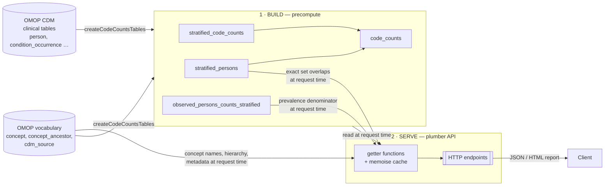

# ROMOPAPI — Project Structure

ROMOPAPI is an R package that serves aggregate statistics (code counts and
concept reports) computed from an **OMOP CDM** database
It works in two phases:

1. **Build** — a one-off job scans the OMOP CDM and writes small *precomputed
   counts tables* into the results schema. Repeated whenever the data or the
   counting logic changes.
2. **Serve** — a [plumber](https://www.rplumber.io/) API answers requests by
   reading those precomputed tables, wrapping the results in reports and JSON.

Everything runs against any OMOP CDM: local **SQLite** (Eunomia,
for tests/demo) or remote **BigQuery** (FinnGen, for production). SQL is written
once in the OHDSI SQL Server dialect and translated per backend with `SqlRender`.

```mermaid
flowchart LR
    CDM[(OMOP CDM<br/>clinical tables<br/>person, condition_occurrence …)]
    VOCAB[(OMOP vocabulary<br/>concept, concept_ancestor,<br/>cdm_source)]

    subgraph build [1 · BUILD  — precompute]
        S[stratified_code_counts]
        P[stratified_persons]
        O[observed_persons_counts_stratified]
        C[code_counts]
        S --> C
        P --> C
    end

    subgraph serve [2 · SERVE  — plumber API]
        G[getter functions<br/>+ memoise cache]
        E[[HTTP endpoints]]
        G --> E
    end

    CDM -->|createCodeCountsTables| build
    VOCAB -->|createCodeCountsTables| build
    build -->|read at request time| G
    P -->|exact set overlaps<br/>at request time| G
    O -->|prevalence denominator<br/>at request time| G
    VOCAB -->|concept names, hierarchy,<br/>metadata at request time| G
    E -->|JSON / HTML report| Client[Client]
```

Note that the API reads from **two** sources at request time: the precomputed
counts tables *and* the OMOP vocabulary tables (`concept`, `concept_ancestor`,
`cdm_source`) — the counts hold the numbers, the vocabulary supplies concept
names, hierarchy and metadata.

The rest of this document walks through each part, starting from the shared
database layer that everything else is built on.

---

## 0 · File structure

The repo is a **standard R package** — most of the layout is the conventional
one and behaves as you'd expect:

- `R/` — package source (all functions). `DESCRIPTION`, `NAMESPACE`, `NEWS.md`,
  `LICENSE` — package metadata. `tests/` — testthat suite. `vignettes/` —
  long-form docs. `inst/` — files installed alongside the package (`sql/`,
  `reports/`, `plumber/`, `scripts/`, `testdata/`).
- **Tool-managed, don't hand-edit:** `man/` and `NAMESPACE` are generated by
  roxygen2 (`devtools::document()`); `renv/` + `renv.lock` are the renv
  dependency lockfiles.

A few things depart from the standard layout:

- **Non-standard files kept in the repo:** `Dockerfile` / `.dockerignore`
  (production image), `.github/` (CI), `development/` (this doc + `STYLE.md` —
  contributor guides, excluded from the build via `.Rbuildignore`),
  `CLAUDE.md` / `AGENTS.md` + `.claude/` (agent instructions and skills),
  `R/api.R` (a superseded `create_api()` stub — see §4).
- **Kept local via `.gitignore`** (not committed, and why):
  - `GITHUBPAT.txt` — GitHub PAT for the Docker build secret; a credential, must
    never be committed.
  - `eunomia_data/`, `FinnGenR12_v5.4*.sqlite` — downloaded/large OMOP database
    files; too big for git and reproducible on demand.
  - `errorReportSql.txt` — SqlRender's error dump, regenerated on each failure.
  - `renv/`, `renv.lock`, `.Rprofile` — local renv environment state.
  - `.scratchpad/` — a personal scratch space for tmp ideas, throwaway tests
    and working notes; never part of the package.

---

## 1 · Database access layer

Every function in the package — build and serve alike — takes a single object
that owns the connection and knows where the tables live.

- **`CDMdbHandler`** (`R/HadesExtras.R`) bundles the DBI connection and the three
  schema names it addresses:
  - `cdmDatabaseSchema` — the OMOP CDM **clinical** tables (`person`,
    `condition_occurrence`, `observation_period`, …), read only during the build.
  - `vocabularyDatabaseSchema` — the OMOP **vocabulary** tables (`concept`,
    `concept_ancestor`, `cdm_source`), read during both build and serve.
  - `resultsDatabaseSchema` — where the precomputed counts tables are written and
    later read from.
  It is **vendored** from HadesExtras v1.1.2 to avoid a heavy dependency — don't
  edit it to add features; re-sync from upstream if needed.
- **`HadesExtras_createCDMdbHandlerFromList()` / `HadesExtras_readAndParseYaml()`**
  build the handler from a parsed `databasesConfig.yml`.
- **`DatabaseConnector`** comes from a fork
  (`javier-gracia-tabuenca-tuni/DatabaseConnector@bigquery-DBI-2`) that adds
  BigQuery DBI support — intentional, see AGENTS.md → *Dependencies*.
- **`SqlRender`** renders `@param` placeholders and translates SQL Server → target
  dialect at runtime. The dialect folder (`inst/sql/sql_server` vs
  `inst/sql/bigquery`) is chosen from `connection@dbms`.

---

## 2 · Precompute: the counts tables

The build phase produces **four** tables in the results schema, in order. The
first three are fine-grained (one stratified by event, one by person, one the
population-at-risk denominator); the fourth rolls the first two up along the
concept hierarchy. Entry point: `createCodeCountsTables()`
(`R/createCodeCountsTables.R`), called by `runApiServer(buildCountsTable = TRUE)`.

### 2a · `stratified_code_counts`

One row per unique combination of stratification keys, for every domain:

| Column | Meaning |
|--------|---------|
| `concept_id` | standard OMOP concept of the event |
| `maps_to_concept_id` | the source concept it maps from |
| `visit_group_concept_id` | FinnGen visit-source grouping (`0` when disabled) |
| `calendar_year`, `gender_concept_id`, `age_decile` | demographic / time strata |
| `record_counts` | number of events in that stratum |

- **R:** `createStratifiedCodeCountsTable()`
  (`R/createStratifiedCodeCountsTable.R`) creates the empty table, then loops
  over the OMOP domains (Condition, Procedure, Drug, Measurement, Observation,
  Device, Visit) and appends one domain at a time. The domain→table/field map is
  defined inline in that function.
- **SQL:** `inst/sql/{sql_server,bigquery}/appendToStratrifiedCodeCountsTable.sql`
  joins each domain table to `person` and `observation_period`, derives the
  strata, and `GROUP BY`s to counts. Events are kept even when the standard
  concept is unmapped (`concept_id = 0`) as long as the source concept is known.
- **Visit grouping** is guarded by SqlRender's
  `{@visit_group_concept_ids != 0} ? {…} : {0}` so the same template works with
  or without the FinnGen visit-source-group list (see AGENTS.md →
  *Database-dependent settings*).

### 2b · `stratified_persons` — the exact person-level bridge

Distinct-person counts can't be summed across strata, and overlap questions
(does this person also have that other code?) need the actual person, not a
summary. So a second table keeps `person_id` instead of collapsing it to a
count — one row per distinct `concept_id × stratum × person_id`:

| Column | Meaning |
|--------|---------|
| `person_id` | the OMOP person |
| `concept_id`, `maps_to_concept_id`, `visit_group_concept_id`, `calendar_year`, `gender_concept_id`, `age_decile` | same grain as `stratified_code_counts` |

`createStratifiedPersonsTable()` (`R/createStratifiedPersonsTable.R`) mirrors
`createStratifiedCodeCountsTable()` — same domain loop, same per-domain SQL
templates (`inst/sql/{sql_server,bigquery}/appendToStratifiedPersonsTable.sql`),
just `SELECT DISTINCT` instead of `COUNT`/`GROUP BY`. `COUNT(DISTINCT person_id)`
over this table is exact on every backend (unlike a sketch, it works the same
on SQLite and BigQuery) and is what `code_counts` (§2c), `getPersonCountsFilters()`
and `getPersonCountsUpset()` (§3) build on. See `.scratchpad/no_HLL_or_sketches.md` for why sketches
(HLL/KMV/Theta) were rejected in favor of this exact bridge: strata are small
(median ~5 persons/row) so exact overlap is cheap, and sketches either can't
intersect at all (HLL) or need to sample nearly the whole set to resolve the
tiny bars an overlap plot cares about.

### 2b-bis · `stratified_measurements` — event-level measured values

Histograms of lab values need the value itself, which neither table above keeps.
`createStratifiedMeasurementsTable()` (`R/createStratifiedMeasurementsTable.R`)
writes one row **per measurement event that has a numeric `value_as_number`** —
deliberately *not* de-duplicated, since a histogram counts events:

| Column | Meaning |
|--------|---------|
| `concept_id`, `maps_to_concept_id`, `visit_group_concept_id`, `calendar_year`, `gender_concept_id`, `age_decile` | same grain/derivation as the two tables above |
| `unit_concept_id` | unit the value was recorded in (`0` when absent) |
| `value_as_number` | the measured value |

Same domain-loop shape as its two siblings (`inst/sql/sql_server/appendToStratifiedMeasurementsTable.sql`),
but Measurement-only. The value is stored **raw rather than pre-binned**: the
histogram's bin breaks depend on which concepts are actually queried (a
descendant-expanded token pools an arbitrary ancestor's descendants), which is
only known at request time — so binning cannot be precomputed per concept.

Unlike the other two templates there is no `inst/sql/bigquery/` override; the
`sql_server` template translates cleanly, and the loader falls back to it.

### 2c · `code_counts` — how the stratified tables are rolled up

`code_counts` is derived **from** `stratified_code_counts` and
`stratified_persons` (it never touches the raw CDM again), inside
`inst/sql/{sql_server,bigquery}/createCodeCountsTable.sql`:

1. **Collapse strata → atomic per-concept counts.** Sum `record_counts` (and,
   from the person bridge, take distinct persons) across all strata for each
   concept. Two sources are unioned so both the standard concept and its
   unmapped source code get a row: grouping by `concept_id`, then by
   `maps_to_concept_id` where the two differ.
2. **Add the hierarchy → descendant rollup.** Join those atomic counts to
   `concept_ancestor` so every concept also gets the sum of **all its
   descendants'** event counts, a count of how many descendants it has, and the
   **distinct** person count across the concept and its descendants (computed
   as `COUNT(DISTINCT person_id)` over the bridge — descendant person counts are
   never summed, since the same person can appear under more than one
   descendant).

The result is one row per concept:

| Column | Meaning |
|--------|---------|
| `concept_id` | the concept |
| `record_counts` | its own events (atomic, from step 1) |
| `descendant_record_counts` | events of the concept **and all descendants** (step 2) |
| `number_of_descendants` | size of that descendant set |
| `person_counts` | distinct persons with the concept's own events |
| `descendant_person_counts` | distinct persons across the concept **and all descendants** |

This table powers the "does this concept have any data, and how much" lookups
that the API front-loads (`getAllConceptsInfo`'s underlying join, and
`getConceptRelationships()$concepts`), while `stratified_code_counts` is kept
for the per-concept, per-stratum detail `/getCodeCountsStratified` and
`/report` need, and `stratified_persons` backs the exact stratum breakdowns and
set-overlap regions `/getPersonCountsFilters` and `/getPersonCountsUpset` need.

### 2d · `observed_persons_counts_stratified` — the prevalence denominator

A per-year prevalence needs a denominator — how many persons were even under
observation that year — and that denominator must stay **exact** under
filtering the same way the numerator does. Within one calendar year a person
has exactly one `gender_concept_id` and exactly one `age_decile`, so
`calendar_year × gender_concept_id × age_decile` is a **partition**: summing
`observed_persons_counts` over any subset of sex/age/year cells is exact.
`visit_group_concept_id` is **not** a partition — the same person can have both
an inpatient and an outpatient visit in the same year — so this table carries
no visit dimension at all; a visit-conditioned denominator would need a
person-level table instead (orders of magnitude larger) to stay exact.

| Column | Meaning |
|--------|---------|
| `calendar_year` | the year |
| `gender_concept_id`, `age_decile` | demographic strata |
| `observed_persons_counts` | distinct persons under observation in that stratum |

`createObservedPersonsCountsTable()` (`R/createObservedPersonsCountsTable.R`)
builds it from `person` joined to `observation_period`
(`inst/sql/sql_server/createObservedPersonsCountsTable.sql`), **after**
`stratified_code_counts` — the set of years it covers is read from that table
(`SELECT DISTINCT calendar_year`), not independently computed, so the
denominator never extends past the years the API can ever show. It is read by
`getPersonCountsPrevalence()` (§3) as the denominator for per-year prevalence;
`sexStratum`/`ageStratum`/`yearsRange` narrow it exactly, `visitStratum` does
not (it narrows the numerator only).

---

## 3 · Data-extraction functions (getters)

Plain R functions that read the precomputed tables (from `resultsDatabaseSchema`)
and join in the vocabulary tables (from `vocabularyDatabaseSchema`) for names,
hierarchy and metadata. Each has a **`_memoise`** twin (via the `memoise`
package) that caches results in-process; the `CDMdbHandler` argument is omitted
from the cache key. The API calls the memoised versions.

| Function (file) | Reads from | Returns |
|-----------------|------------|---------|
| `getAllConceptsInfo()` (`R/getAllConceptsInfo.R`) | `code_counts` ⨝ `concept` (join only restricts to concepts that have counts — the counts themselves aren't returned) — the catalogue of every concept that has counts, with its name/vocabulary/class | tibble |
| `getConceptTree()` (`R/getConceptTree.R`) | `concept_ancestor` — builds the family tree pruned to nodes that have counts or a counted descendant. Shared by `getConceptRelationships()` and `getCodeCountsStratified()` so the tree is built once | list(family_tree, concept_ids) |
| `getConceptRelationships()` (`R/getConceptRelationships.R`) | `getConceptTree_memoise` (the tree) and `code_counts` ⨝ `concept` scoped to the tree's concept ids (for details + counts); 'Maps to'/'Mapped from' are derived from the stratified table's `maps_to_concept_id` column | list of tibbles |
| `getCodeCountsStratified()` (`R/getCodeCountsStratified.R`) | `getConceptTree_memoise` (the tree) and `stratified_code_counts` (per-stratum counts for the concept, its descendants and mapped codes) | tibble |
| `getPersonCountsFilters()` (`R/getPersonCountsFilters.R`) | `stratified_persons` (the exact person bridge), via `.parsePersonCountsConceptIds()`/`.resolveTaggedConceptIdSets()` (`R/parsePersonCountsConceptIds.R`) — sex/age/visit/year breakdowns for the pooled population of an explicit list of tagged concept sets | tibble |
| `getPersonCountsUpset()` (`R/getPersonCountsUpset.R`) | `stratified_persons`, via the same tagged-concept-id helpers — exact set-overlap (UpSet) regions across an explicit list of tagged concept sets, over an optional `yearsRange` and the requested strata; per-concept `person_counts`/`descendant_person_counts` are read from `code_counts` via `getConceptRelationships()`'s `concepts` tibble instead of being duplicated here | tibble |
| `getMeasurementValueHistogram()` (`R/getMeasurementValueHistogram.R`) | `stratified_measurements` ⨝ `concept` (unit codes), via the same tagged-concept-id helpers — a robust (median ± 7·MAD) histogram of measured values per tagged set and unit | tibble |
| `getPersonCountsPrevalence()` (`R/getPersonCountsPrevalence.R`) | `stratified_persons` (numerator) and `observed_persons_counts_stratified` (denominator), via the same tagged-concept-id helpers — per-year distinct-person counts for each tagged concept set, alongside the matching population-at-risk; `visitStratum` narrows the numerator only | tibble |
| `getPersonCountsIncidence()` (`R/getPersonCountsIncidence.R`) | Same tables as `getPersonCountsPrevalence()`, but the numerator is restricted to each person's absolute first-ever record of the token's id set (`.buildIncidentRowsSql()`, `R/parsePersonCountsConceptIds.R`) — per-year distinct **first-occurrence** person counts, alongside the same population-at-risk denominator | tibble |
| `getPersonCountsIncidenceFilters()` (`R/getPersonCountsIncidenceFilters.R`) | Same as `getPersonCountsFilters()`, but pooling each set's first-occurrence rows (`.buildIncidentRowsSql()`) instead of every raw occurrence — sex/age/visit/year breakdown of the pooled first-incident-event population | tibble |
| `getVisitTypeNames()` (`R/getVisitTypeNames.R`) | `stratified_code_counts` (distinct `visit_group_concept_id`) ⨝ `concept` (their names/codes) | tibble |
| `getAPIInfo()` (`R/getAPIInfo.R`) | `cdm_source` (CDM name, vocabulary version) + package version | list |
| `getLogs()` / `sendFeedback()` (`R/getLogs.R`, `R/sendFeedback.R`) | in-process log file / feedback capture — no DB | — |

### Output shapes

Exact columns each getter returns. All names are **snake_case** (see STYLE.md →
*SQL*). These are also what the endpoints serialize to JSON — the endpoints are
thin wrappers, except where noted.

#### `getAllConceptsInfo()` → one tibble

One row per concept that has counts. The catalogue the API front-loads.

| Column | Meaning |
|--------|---------|
| `concept_id` | the concept |
| `concept_name` | human-readable name |
| `domain_id` | OMOP domain (Condition, Procedure, Drug, …) |
| `vocabulary_id` | vocabulary (SNOMED, ICD10, …) |
| `concept_class_id` | concept class |
| `standard_concept` | logical — `TRUE` for standard concepts |
| `concept_code` | source code within the vocabulary |

Counts (`record_counts`, `descendant_record_counts`, `number_of_descendants`,
`person_counts`, `descendant_person_counts`) are **not** included — this is a
pure concept-metadata catalogue; read counts from `code_counts` directly (e.g.
via `getConceptRelationships()$concepts` below).

> The `/getListOfConcepts` endpoint returns a **subset** of these columns:
> `concept_id`, `concept_name`, `vocabulary_id`, `concept_code`.

#### `getConceptTree()` → `list(family_tree, concept_ids)`

The tree-building block shared by `getConceptRelationships()` and
`getCodeCountsStratified()` (memoised as `getConceptTree_memoise`).
`getPersonCountsFilters()`/`getPersonCountsUpset()` don't use it — they resolve
each of their tagged `conceptIds` entries directly against `concept_ancestor`
via `.resolveTaggedConceptIdSets()` (`R/parsePersonCountsConceptIds.R`).
`family_tree`
has the same `parent_concept_id`/`child_concept_id`/`levels`/`paths` shape as
the tree rows in `concept_relationships` below (minus the mapping edges, which
`getConceptRelationships()` derives separately since it depends on its own
counts read). `concept_ids` is the unique, `"-1"`-excluded concept-id list used
to query the counts tables.

#### `getConceptRelationships()` → list of **two** tibbles

Keyed `concept_relationships`, `concepts`.

**`concept_relationships`** — the concept's family tree plus mapping edges. One
row per parent→child edge:

| Column | Meaning |
|--------|---------|
| `parent_concept_id` | parent (ancestor) concept |
| `child_concept_id` | child (descendant), or the mapped concept for mapping edges |
| `levels` | edge type / depth: `"0"` (the queried concept), `"-1"` (its direct parent), `"N-M"` (min–max hierarchy levels), or `"Maps to"` / `"Mapped from"` |
| `concept_class_id` | concept class of the child |

**`concepts`** — details for every concept referenced in the tree (same columns
as `getAllConceptsInfo` plus the counts columns, minus `number_of_descendants`):
`concept_id`, `concept_name`, `domain_id`, `vocabulary_id`, `concept_class_id`,
`standard_concept`, `concept_code`, `record_counts`, `descendant_record_counts`,
`person_counts`, `descendant_person_counts`.

#### `getCodeCountsStratified()` → one tibble

Per-concept, per-stratum counts for every node in the tree:

| Column | Meaning |
|--------|---------|
| `concept_id` | the concept |
| `visit_group_concept_id` | FinnGen visit-source grouping (`0` when disabled) |
| `calendar_year`, `gender_concept_id`, `age_decile` | demographic / time strata |
| `node_record_counts` | events of this concept in the stratum |
| `node_descendant_record_counts` | events of this concept **and its descendants** in the stratum |

#### Tagged `conceptIds` — shared by both functions below

`getPersonCountsFilters()` and `getPersonCountsUpset()` take an explicit list
of tagged concept references instead of a single `conceptId` + tree: a
comma-separated string of `<conceptId><S|M><D?>` tokens, e.g.
`"317009S,4191479SD,2000403993M,2000403993MD"`. `S`/`M` picks which
`stratified_persons` column to match (`concept_id` vs `maps_to_concept_id`); a
trailing `D` expands the token to the concept **and all its descendants**
(via `concept_ancestor`, self-inclusive) instead of the exact code alone. Two
tokens sharing a raw concept id but differing in tag (e.g. `2000403993M` vs
`2000403993MD`) are independent sets. Parsed and resolved once by
`.parsePersonCountsConceptIds()` / `.resolveTaggedConceptIdSets()`
(`R/parsePersonCountsConceptIds.R`), shared by both getters — neither getter
uses `getConceptTree()`.

#### `getPersonCountsFilters()` → one tibble

A breakdown, by each filterable dimension, of the **pooled** population across
every set in `conceptIds` (not one row per set — see `getPersonCountsUpset()`
for the per-set breakdown). Each dimension is computed with the *other three*
dimensions' filters applied, but not its own, so a client can see how e.g. the
sex breakdown looks under the current age/visit/year filters while still being
told which value(s) were actually selected for sex.

| Column | Meaning |
|--------|---------|
| `filter` | which dimension: `"sex"`, `"age"`, `"visit"`, or `"year"` |
| `stratum` | the `gender_concept_id` / `age_decile` / `visit_group_concept_id` / `calendar_year` value |
| `person_counts` | distinct persons with that stratum value, with the other three dimensions' filters applied |
| `selected` | `TRUE` if this stratum value was part of that dimension's own filter (`sexStratum`/`ageStratum`/`visitStratum`/`yearsRange`), else `FALSE` |

#### `getPersonCountsUpset()` → one tibble

Exact UpSet exclusive-region counts across the sets in `conceptIds`,
restricted to `yearsRange` and the requested strata (`sexStratum`,
`ageStratum`, `visitStratum`). Computed by pulling each person's membership
across the target sets from `stratified_persons` and grouping — exact, not
sketch-reconstructed (see §2b):

| Column | Meaning |
|--------|---------|
| `group` | the tagged tokens of the exclusive region, joined by `"-"` (e.g. `"317009SD"` or `"317009S-317009SD"`) |
| `person_counts` | distinct persons in exactly that region (no more, no fewer of the target sets) |

#### `getMeasurementValueHistogram()` → one tibble

A histogram of `value_as_number`, for `Measurement`-domain concepts only (other
domains are rejected). Takes the same tagged `conceptIds` + strata inputs as
`getPersonCountsUpset()`, plus `nBins` (default 100).

| Column | Meaning |
|--------|---------|
| `tagged_conceptid` | the entry of `conceptIds` this row's events belong to (e.g. `"40652733SD"`) |
| `measured_value_bucket` | right-closed `(x1, x2]` bucket label |
| `unit` | `concept_code` of the unit; `NA` when none was recorded |
| `n_events` | events in that bucket, for that entry |

Bins are computed **per unit**, pooled across every entry of `conceptIds` that
shares that unit:

- **Same unit → one histogram.** The entries come back on identical buckets, one
  series each, so a client can stack them as coloured segments of the same bar
  (a bin's full height is the total, split per `tagged_conceptid`).
- **Different units → separate histograms**, each with its own bucket scale,
  since values in different units are not comparable.

A row exists per `(tagged_conceptid, unit, bin)`. Note the breaks pool the events
of every entry sharing a unit, so overlapping entries (the same event matched by
two entries) weight that event more than once in the median/MAD — exact for the
usual disjoint case.

The range is robust — `median ± 7·MAD`, not min/max — so one extreme outlier
cannot collapse every real value into a single bin; out-of-range values land in
an underflow bin (`(-Inf, x]`) and an overflow bin (`(x, +Inf]`), so every event
is still counted. A zero MAD (all values identical) widens the range by a small
fixed step. All `nBins + 2` bins are returned per partition, zero-filled.

Crucially the breaks come from the **unfiltered** events of each partition while
the counts come from the **filtered** ones, so the buckets stay fixed as a client
changes `yearsRange`/`sexStratum`/`ageStratum`/`visitStratum`.

Median and MAD are computed in SQL via `ROW_NUMBER()`/`COUNT() OVER` + `AVG` of
the middle row(s) rather than `PERCENTILE_CONT` (absent in SQLite, spelled
differently in BigQuery), so no values ever leave the database.

#### `getPersonCountsPrevalence()` → one tibble

Per tagged concept set per calendar year: the exact distinct-person numerator
alongside the population-at-risk denominator (§2d), restricted to `yearsRange`
and the requested strata. `sexStratum`/`ageStratum`/`yearsRange` narrow both
numerator and denominator exactly; `visitStratum` narrows the numerator only.
Returns raw counts, not a rate — `person_counts / observed_persons_counts *
100` is the client's (and the report plot's) job. Rows whose year has no
denominator are dropped, since no prevalence can be formed there.

| Column | Meaning |
|--------|---------|
| `tagged_concept_id` | the tagged token from `conceptIds` (e.g. `"317009SD"`) |
| `calendar_year` | the year |
| `person_counts` | distinct persons matching that token's id set and the requested strata, in that year |
| `observed_persons_counts` | distinct persons under observation in that year, matching `sexStratum`/`ageStratum`/`yearsRange` only |

#### `getPersonCountsIncidence()` → one tibble

Per tagged concept set per calendar year: the exact distinct-person numerator,
counting a person only **once** — in the year of their first-ever record of
that token's id set (the concept itself or any requested descendant) —
alongside the same population-at-risk denominator `getPersonCountsPrevalence()`
uses. A person's first-ever record is computed **ignoring every filter**;
`sexStratum`/`ageStratum`/`visitStratum`/`yearsRange` only decide whether that
already-fixed incident event qualifies for the count, they never change which
year counts as "first" (see `.buildIncidentRowsSql()`,
`R/parsePersonCountsConceptIds.R`). One consequence: narrowing `yearsRange` can
legitimately return an all-zero row for a token whose true first-ever year
falls outside the range — unlike `getPersonCountsPrevalence()`, where every
year in range can show a nonzero count.

| Column | Meaning |
|--------|---------|
| `tagged_concept_id` | the tagged token from `conceptIds` (e.g. `"317009SD"`) |
| `calendar_year` | the year |
| `person_counts` | distinct persons whose first-ever record of that token's id set falls in this year and matches the requested strata |
| `observed_persons_counts` | distinct persons under observation in that year, matching `sexStratum`/`ageStratum`/`yearsRange` only |

#### `getPersonCountsIncidenceFilters()` → one tibble

Same shape and semantics as `getPersonCountsFilters()`, but pooling each set's
**first-occurrence** rows instead of every raw occurrence — each of the four
dimensions is computed with the *other three* dimensions' filters applied, but
not its own, and a person's first-ever record is fixed ignoring every filter
(same rule as `getPersonCountsIncidence()` above).

| Column | Meaning |
|--------|---------|
| `filter` | which dimension: `"sex"`, `"age"`, `"visit"`, or `"year"` |
| `stratum` | the `gender_concept_id` / `age_decile` / `visit_group_concept_id` / `calendar_year` value |
| `person_counts` | distinct persons incident (first-ever record) in that stratum, with the other three dimensions' filters applied |
| `selected` | `TRUE` if this stratum value was part of that dimension's own filter, else `FALSE` |

#### `getVisitTypeNames()` → one tibble

One row per FinnGen visit-source group present in the counts (empty when grouping
is disabled):

| Column | Meaning |
|--------|---------|
| `visit_group_concept_id` | the visit group concept |
| `concept_code` | its OMOP concept code |
| `concept_name` | its human-readable name |

#### `getAPIInfo()` → named list (4 scalars)

| Field | Meaning |
|-------|---------|
| `cdm_source_name` | CDM source name (from `cdm_source`) |
| `cdm_source_abbreviation` | CDM source abbreviation |
| `vocabulary_version` | OMOP vocabulary version |
| `romop_api_version` | installed ROMOPAPI package version |

#### `getLogs()` / `sendFeedback()`

- `getLogs()` → **character vector**, one element per log line from the
  in-process ParallelLogger file.
- `sendFeedback()` → `NULL` (writes the feedback to the log as a side effect; the
  `/sendFeedback` endpoint replies `{ message: "Feedback sent" }`).

### Reports & plots

`createReport()` (`R/createReport.R`) renders `inst/reports/testReport.Rmd` to a
self-contained HTML report for a concept: a Mermaid hierarchy diagram plus
stratified tables and charts. It pulls its data through
`getConceptRelationships_memoise` and `getCodeCountsStratified_memoise`
(reassembled into the same `list(concept_relationships, concepts,
stratified_code_counts)` shape the plotting helpers expect) and builds visuals
with the helpers in `R/plotingFunctions.R` (ggplot2 / plotly / reactable). Each
Mermaid node is labeled `RC`/`DRC` (record / descendant record counts, global)
and `PC`/`DPC` (person / descendant person counts, global), with the in-tree
"shown" subtree sum in parens next to RC/DRC when pruning narrows the displayed
descendants. `inst/reports/mermaid.min.js` is served locally so reports need no
CDN.

A **Person Counts** section pulls `getPersonCountsFilters_memoise`,
`getPersonCountsUpset_memoise`, `getPersonCountsPrevalence_memoise`,
`getPersonCountsIncidence_memoise` and `getVisitTypeNames_memoise` separately
and renders: a pie chart of persons by sex (`createSexPieChartFromPersonCounts`),
a bar chart by age decile (`createAgeHistogramFromPersonCounts`), a bar chart by
visit-source group (`createVisitBarplotFromPersonCounts`), an UpSet plot of the
exact set-overlap regions (`createUpsetPlotFromPersonCounts`), a clustered dot
chart of per-year prevalence, one series per tagged concept set
(`createPrevalencePlotFromPersonCounts`), and the same chart for per-year
incidence (`createIncidencePlotFromPersonCounts`) — all in `R/plotingFunctions.R`.

A **Measured Values** section follows it, but only for `Measurement`-domain
concepts: it pulls `getMeasurementValueHistogram_memoise` with the same
`<conceptId>SD` token the person-counts section uses, and renders
`createMeasurementHistogramPlot()` — one facet per unit, bars stacked by
`tagged_conceptid`. The Rmd
decides up front whether the concept is a Measurement (from
`getConceptRelationships()`'s `concepts` tibble) and skips the section entirely
otherwise, since the getter deliberately errors on other domains. It is also
skipped when a Measurement concept simply has no numeric values recorded.

---

## 4 · The API (plumber)

`runApiServer()` (`R/runApiServer.R`) is the single entry point. It:

1. builds a `CDMdbHandler` from config (or the bundled Eunomia test DB if none),
2. optionally rebuilds the counts tables (`buildCountsTable = TRUE`),
3. warms the cache (`getAllConceptsInfo_memoise`),
4. loads the router and runs it on port **8564** with CORS enabled.

The **endpoints are defined in `inst/plumber/plumber.R`** — that is the live
router. Each endpoint is a thin wrapper that validates params and delegates to a
memoised getter:

| Endpoint | Backed by |
|----------|-----------|
| `GET /getConceptRelationships?conceptId=` | `getConceptRelationships_memoise` |
| `GET /getCodeCountsStratified?conceptId=` | `getCodeCountsStratified_memoise` |
| `GET /getPersonCountsFilters?conceptIds=&yearsRange=&sexStratum=&ageStratum=&visitStratum=` | `getPersonCountsFilters_memoise` |
| `GET /getPersonCountsUpset?conceptIds=&yearsRange=&sexStratum=&ageStratum=&visitStratum=` | `getPersonCountsUpset_memoise` |
| `GET /getMeasurementValueHistogram?conceptIds=&yearsRange=&sexStratum=&ageStratum=&visitStratum=&nBins=` | `getMeasurementValueHistogram_memoise` |
| `GET /getPersonCountsPrevalence?conceptIds=&yearsRange=&sexStratum=&ageStratum=&visitStratum=` | `getPersonCountsPrevalence_memoise` |
| `GET /getPersonCountsIncidence?conceptIds=&yearsRange=&sexStratum=&ageStratum=&visitStratum=` | `getPersonCountsIncidence_memoise` |
| `GET /getPersonCountsIncidenceFilters?conceptIds=&yearsRange=&sexStratum=&ageStratum=&visitStratum=` | `getPersonCountsIncidenceFilters_memoise` |
| `GET /getListOfConcepts` | `getAllConceptsInfo_memoise` |
| `GET /getVisitTypeNames` | `getVisitTypeNames_memoise` |
| `GET /getAPIInfo` | `getAPIInfo` |
| `GET /report?conceptId=&showsMappings=&pruneLevels=&pruneClass=` | `createReport` (HTML) |
| `GET /mermaid.min.js` | static asset for reports |
| `GET /getLogs`, `POST /sendFeedback`, `GET /echo` | ops / health |

`yearsRange` is `"startYear,endYear"` (e.g. `2015,2020`); both endpoints that
accept it validate `startYear <= endYear` (400 otherwise).

> Note: `R/api.R` holds an older `create_api()` stub (`/health`,
> `/process-ids`) that `runApiServer()` does **not** use — the served router is
> `inst/plumber/plumber.R`.
